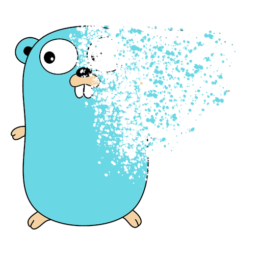

<table align="center"><tr><td align="center" width="9999">


# Gophemeral

Easy Secrets Sharing 

</td></tr></table>


## Overview
Gophemeral is a temporary secret sharing tool. You can input a string and a number of views and Gophemeral will keep the string secret until the number of views runs out.

Secrets must be 200 characters or less in the hosted version. 

Site is [https://gophemeral.com](https://gophemeral.com).

## Usage

Gophemeral also has an API. 

## Create Secret

To create a secret, send a POST request with this payload to `https://gophemeral.com/api/secret`:

```
{
	"text": "this is a test",
	"views": 1
}
```

## Lookup Secret

To retrieve a secret, send a GET request to `https://gophemeral.com/api/secret?id={message-id}` and the password in the header `X-Password`.

## NATS Micro

Gophemeral is also available as a NATS micro. 

You can run it yourself and the default subjects are `gophemeral.secrets.store` and `gophemeral.secrets.get`. The payload for storing a secret is the same, the payload for retrieving a secret is 

```
{
	"id": "<id>",
	"password": "<password>"
}
```

The hosted Gophemeral is also a public export that is available on Synadia Cloud using the default subjects. The public key for the account is `ABMWCVIX4SZJYIDI2QAWBL2IPLF5SA6LPXCKU5MYHO4ILJM7X4VSRF7S`.


## Technologies

The backend for Gophemeral right now is BoltDB.

The site is embedded and uses [HTMX](https://htmx.org/).

Everything is deployed on [Fly.io](https://fly.io)
